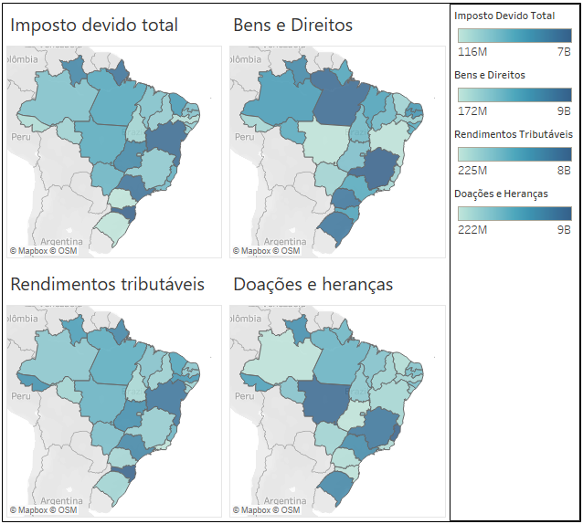
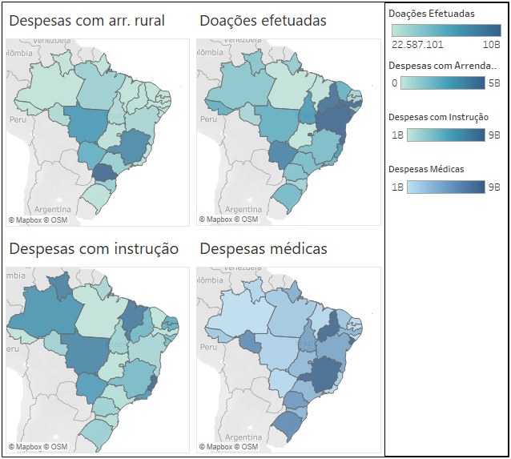

# Impostos e isenção por Unidade Federativa

#### Fonte de dados
* Grandes Números do Imposto de Renda da Pessoa Física do [Portal de Dados de Dados Abertos](https://dados.gov.br/dados/conjuntos-dados/grandes-nmeros-do-imposto-de-renda-da-pessoa-fsica) do Governo Federal

##### Ferramentas utilizadas
**Python** para tratamento, limpeza e visualização de dados e **Tableau** para visualização de dados

### Objetivos
* Importar dados do arquivo CSV
* Limpar e tratar os dados utilizando Python
* Identificar dados de interesse
* Formatar e visualizar os dados
* Criar visualizações mais elaboradas utilizando o Tableau
* Identificar impostos e isenções em 2020 baseado em estados e regiões

[Notebook](imposto.ipynb)

## Impostos

## Despesas
